# ÜniKonak 🏠

ÜniKonak, üniversite öğrencilerinin barınma sorunlarına modern çözümler üretmek amacıyla geliştirilmiş; öğrencilerin yurt, apart ve konaklama yerlerini kolayca bulmasını, filtrelemesini ve incelemesini sağlayan kapsamlı bir mobil uygulamadır.

Bu proje, **Gazi Üniversitesi TUSAŞ Kazan MYO İnternet Programcılığı** dersi dönem sonu projesi olarak **Hasret Özdemir** tarafından geliştirilmiştir.

## 📱 Proje Özellikleri

Proje kapsamında aşağıdaki teknik yetkinlikler ve özellikler hayata geçirilmiştir:

* **Firebase Entegrasyonu:**
    * **Auth:** Kullanıcı kayıt ve güvenli giriş işlemleri.
    * **Firestore:** Yurt verilerinin, favorilerin ve yorumların bulut tabanlı yönetimi.
* **Gelişmiş Arama ve Filtreleme:** Şehir, üniversite, oda kapasitesi, cinsiyet ve fiyat aralığına göre dinamik sorgulama.
* **Harita Entegrasyonu (Google Maps):** Yurtların konumlarının harita üzerinde interaktif gösterimi.
* **Randevu Sistemi:** Yurt ziyareti için tarih ve saat seçerek randevu oluşturma arayüzü.
* **Sosyal Özellikler:** Favorilere ekleme ve yurtlara yorum yapma/okuma.
* **Kullanıcı Deneyimi:** Aydınlık, Karanlık ve Özel tema desteği.

## 📸 Uygulama Ekran Görüntüleri

Uygulamanın temel akışını ve özelliklerini gösteren ekran görüntüleri aşağıdadır:

### 🚀 Başlangıç ve Ana Akış
| Giriş Ekranı | Anasayfa | Filtreleme |
|:---:|:---:|:---:|
| 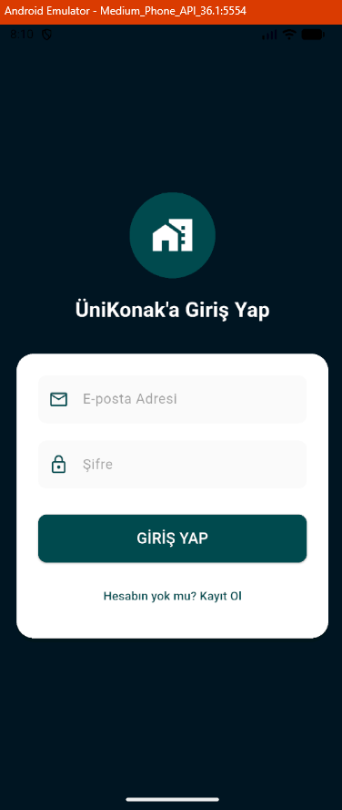 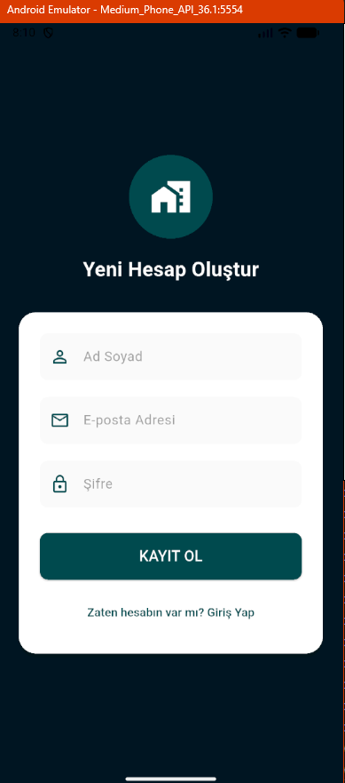 | 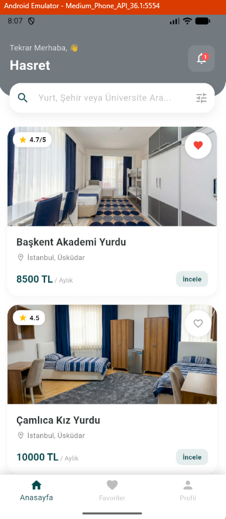 | 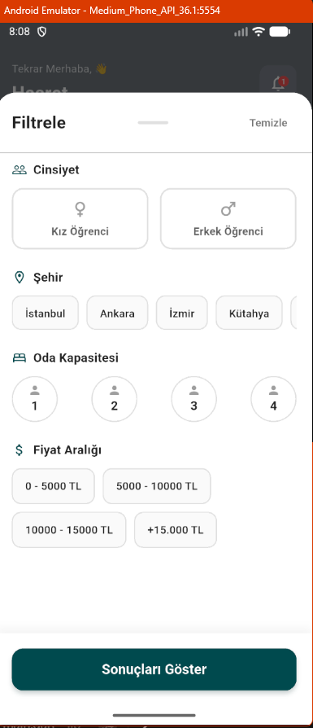 |

### 🏨 Detaylar ve Konum
| Yurt Detayı | Harita ve Randevu | Favorilerim |
|:---:|:---:|:---:|
| 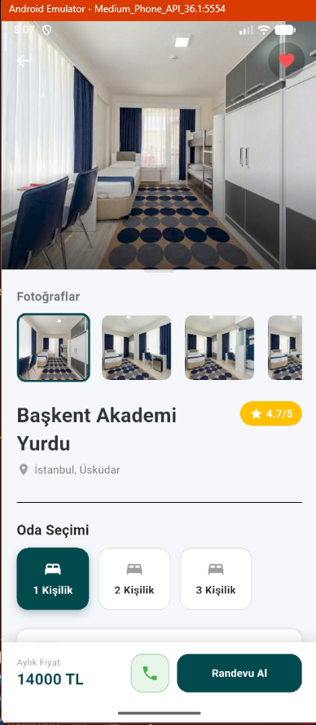 | 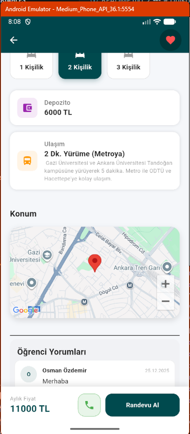  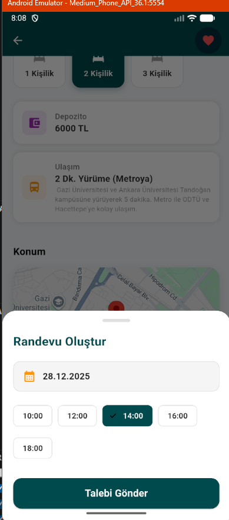 | 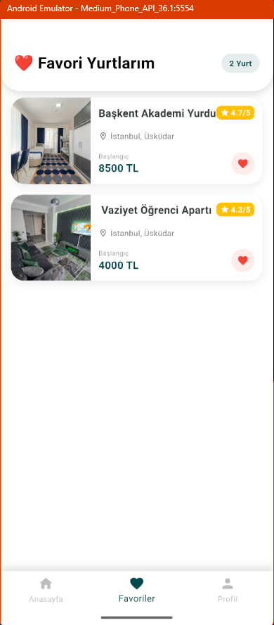 |

### 👤 Profil ve Ayarlar
| Profil Menüsü | Profil Düzenle | Bildirimler |
|:---:|:---:|:---:|
| 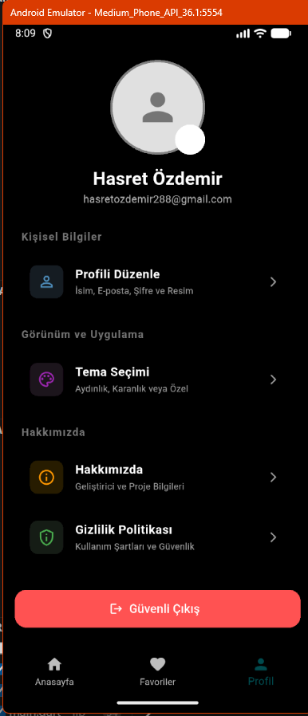 | 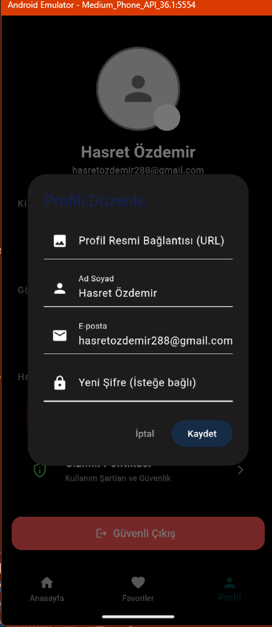 | 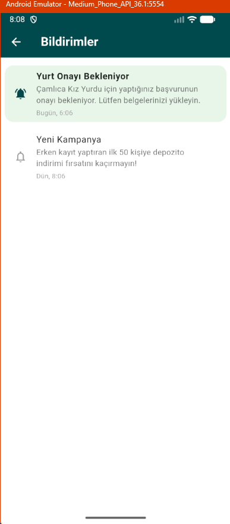 |

### 🎨 Görünüm
| Tema Seçimi | Gizlilik | Hakkımda|
|:---:|:---:|:---:|
| 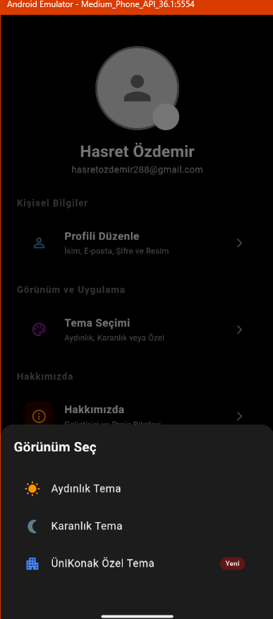 | 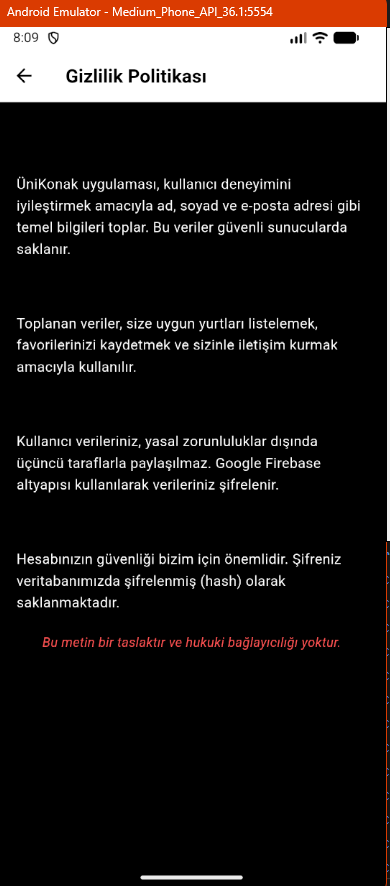 | 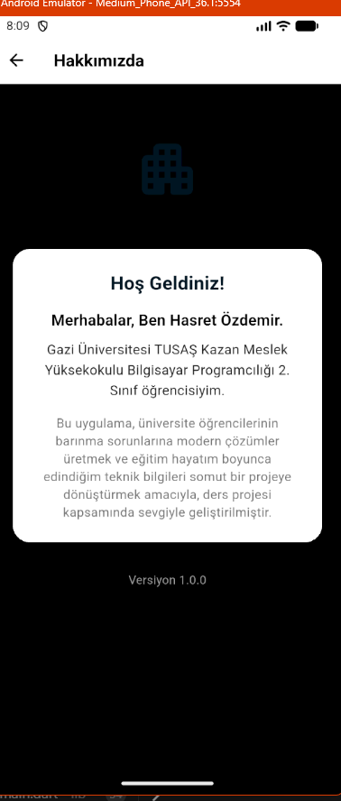 |

*(Not: Tüm görseller `screenshots` klasörü altında barındırılmaktadır.)*

## 🛠 Kullanılan Teknolojiler

* **Dil:** Dart
* **Framework:** Flutter
* **Backend:** Firebase (Authentication, Cloud Firestore)
* **Paketler:** `Maps_flutter`, `firebase_core`, `cloud_firestore`, `firebase_auth`

## 👨‍💻 Geliştirici

**Hasret Özdemir**
Gazi Üniversitesi TUSAŞ Kazan Meslek Yüksekokulu
Bilgisayar Programcılığı 2. Sınıf